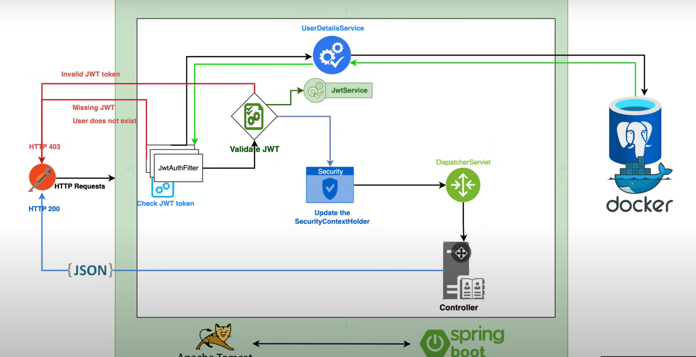

### Annotiations
@Component is a class-level annotation. 

@Service
@Repository
@Controller

Restcontroller

@SpringBootApplication ->  @Configuration, + @EnableAutoConfiguration + @ComponentScan

Configuration

Componentscan
Bean
Autowired
Transactional

Value

AOP

Spring boot applcation flow
Bean Life Cycle

singleton

(Default) Scopes a single bean definition to a single object instance for each Spring IoC container.

prototype

Scopes a single bean definition to any number of object instances.

request

Scopes a single bean definition to the lifecycle of a single HTTP request.

Scop of bean
Dependency Injection
IOC Container
Spring boot Actuator

OAuth2
Spring Security 

